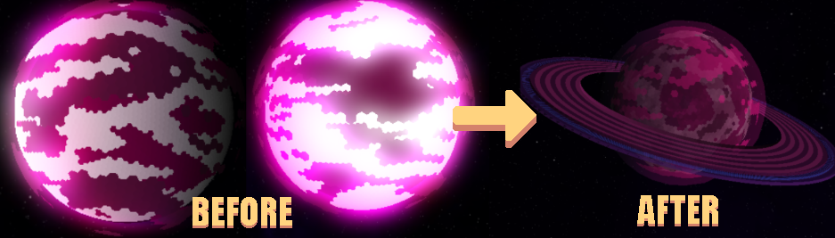

The mod is still in development, but its goal is to add content that complements the base version of Mindustry with new materials and structures, based on Serpulo’s resources.
For now, there’s only content for Serpulo and the new planet Volta. Since I haven’t figured out how to enable erekir technology on Volta, I decided to create new blocks that follow its mechanics and resources.

### 🌐 Languages / Idiomas
- EN **English** (might be some errors)
- ES **Español** 

---

If you have any suggestions, bug reports, or feedback, feel free to open an issue and I’ll try to address it.

## V0.5 beta: 
### Technical changes:
- **Technology tree:** It was moved back to the Serpulo tree due to technical issues with the new planet.
- **Code:** Some elements (such as walls, the mod’s central node, and objects) have been moved to Java to improve organization, fix some bugs, and test the functionality of the Java code.
- **Planet: New Ring:** New ring generation for the planet (the New Horizons Dyson Sphere/Ring generator was used as a reference)
- **Sector:** Planet sector generation finally works, but it needs quite a few improvements.

### Visual changes:
- New sprites for some blocks
- New design for the planet (The front brightness issue has finally been fixed)
- New ring for the planet
  

### New content:
- **A new planet:** “Volta” with one sector has been added (The first sector finally works properly).
- **New drills:** 4 drills (2 normal and 2 beam drills) were created to complement Volta’s design.
- **Environment:** New environment blocks for the planet’s design.
- **Ores:** New silver and palladium ore deposits.
- *We’re still working on the missing sprites.*

---

### 🧩 Compatibility & Testing / Compatibilidad
Volta protocol has been tested with the following mods:
- Fading Revelations Remake
- New Horizon
- Gier: Revitalized
- Warbound Industries
- Better Vanilla
- Mindustry Tool
- Simple additions

*More mods will be tested and added to this list over time. If you play with other mods and find they work well together, feel free to share your feedback!*
